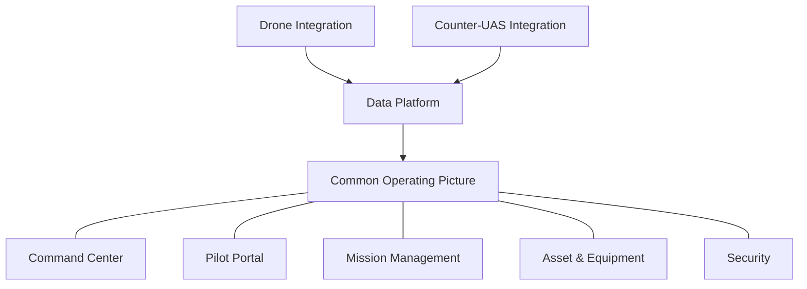
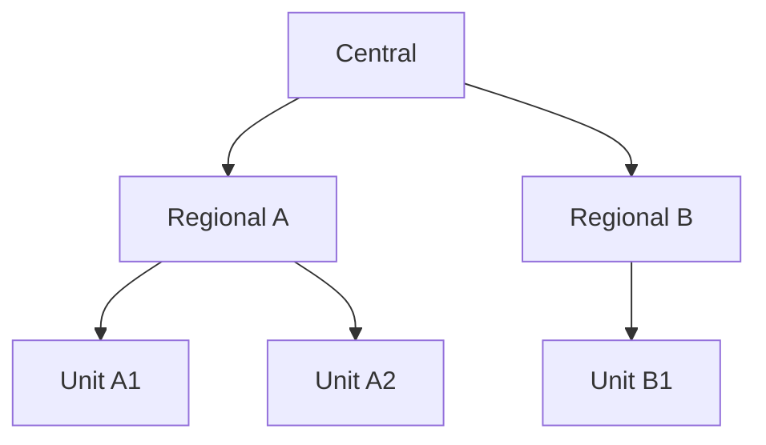
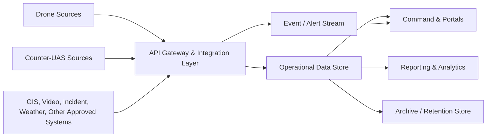

# [PROJECT NAME]
## Master Draft: Police UAS & Counter-UAS Command and Management Platform

> **Document status:** Draft for discussion  
> **Version:** 0.1  
> **Prepared date:** [TBD]  
> **Project owner / sponsor:** [TBD]  
> **Naming note:** `[PROJECT NAME]` is a temporary project and platform name. A permanent name has not yet been approved.

---

## Document purpose and use

This is a master-level draft for establishing an enterprise Police UAS (Unmanned Aircraft System) and Counter-UAS command and management capability. It is deliberately vendor-neutral and does not commit the organization to a product, technical specification, budget, operating model, or procurement approach that has not been approved.

It is intended to be refined into the following documents:

| Downstream document | How this draft is used |
|---|---|
| Concept Paper | Strategic problem, outcomes, scope, and investment rationale |
| Business / Project Plan | Governance, roadmap, resources, facilities, and budget assumptions |
| Requirements Specification | Functional, data, integration, security, and non-functional requirements |
| Solution Architecture | Logical, physical, network, data, and security architecture |
| TOR / Procurement Package | Deliverables, acceptance criteria, minimum specifications, and services |

All unconfirmed matters are marked `[TBD]` or `[TO BE DEFINED]`.

---

## 1. Project Overview

### 1.1 Working title

**[PROJECT NAME] — Police UAS & Counter-UAS Command and Management Platform**

**Thai working description:** โครงการจัดตั้งศูนย์บัญชาการและบริหารจัดการอากาศยานไร้คนขับและระบบต่อต้านอากาศยานไร้คนขับสำหรับหน่วยงานตำรวจ

### 1.2 Vision

Create a secure, interoperable, and scalable platform that provides a common operating picture for police UAS, Counter-UAS, people, missions, assets, data, and operational events across the organization.

### 1.3 Intended outcome

The platform should enable authorized personnel at Central, Regional, and Unit levels to plan, approve, assign, monitor, record, report, and audit UAS-related operations while integrating relevant drone, Counter-UAS, GIS, video, alert, and external-system data.

### 1.4 Design principles

| Principle | Meaning for this project |
|---|---|
| Vendor-neutral | Avoid dependence on a single aircraft, sensor, or software supplier where practical. |
| Modular | Enable modules and integrations to be added or replaced without rebuilding the core platform. |
| API-first | Use governed APIs and standard interfaces for system-to-system exchange. |
| Data-centric | Treat governed, searchable, auditable data as a shared organizational asset. |
| Security by design | Embed identity, access control, encryption, logging, and resilience from the start. |
| Scalable | Support growth in users, sites, devices, data volume, and operational workload. |
| Interoperable | Support integration with approved internal and external systems. |
| AI-ready | Preserve quality data, metadata, storage, and controls needed for future analytics and AI. |
| Human accountability | Keep authority, approval, operational decisions, and legal compliance with authorized officers. |
| **Operational burden is minimized** | The system must reduce—not add to—the administrative workload of field operational teams. Capture data from existing work, integrations, and automation first; ask field staff only for information that cannot be obtained otherwise and is necessary for safety, authority, or accountability. |

---

## 2. Principles and Rationale

UAS use can support public safety operations, surveillance, search and rescue, incident response, evidence collection, and other approved missions. At the same time, the growing availability of civilian and unauthorized drones creates a Counter-UAS information and coordination need.

When aircraft, pilots, mission records, equipment, video, sensor alerts, and local operating practices are managed separately, the organization may have limited visibility, inconsistent controls, fragmented evidence, duplicated procurement, and difficulty scaling operations. `[PROJECT NAME]` is proposed as a coordinated capability to establish common standards, shared situational awareness, traceability, and controlled integration.

The project shall be planned and operated in accordance with applicable law, aviation rules, privacy and data-protection obligations, procurement rules, organizational authority, safety procedures, and approved Counter-UAS policy. The project does **not** presume authorization for any detection, tracking, identification, or response capability that requires a separate legal, policy, or operational approval.

---

## 3. Objectives

1. Establish a central capability for oversight and management of police UAS and related Counter-UAS information.
2. Support controlled command, coordination, and situational awareness for authorized missions.
3. Manage pilots, qualifications, training, authorizations, and operational assignments.
4. Manage UAS, Counter-UAS, sensors, batteries, payloads, network equipment, and associated assets throughout their lifecycle.
5. Integrate approved data from drone platforms, Counter-UAS systems, GIS, video, incident, communication, and other relevant systems.
6. Implement consistent identity, role-based access, audit, data-protection, and cybersecurity controls.
7. Support the Central → Regional → Unit organization model with delegated authority and visibility boundaries.
8. Establish a foundation for analytics, AI, additional sensors, new vendors, and future services.

---

## 4. Scope

### 4.1 In scope

- Command, planning, monitoring, reporting, and audit workflows for approved UAS-related operations.
- Pilot, qualification, training, assignment, and pre/post-flight records.
- Asset registry, custody, availability, maintenance, battery, and lifecycle records.
- Authorized data exchange with drone, Counter-UAS, GIS, video, alert, and other approved systems.
- Common operating picture, dashboards, maps, alerts, incidents, reports, and analytics foundations.
- Facilities, core infrastructure, security controls, governance, operational procedures, and maintenance planning.

### 4.2 Explicit boundaries

- The platform does not automatically grant airspace, surveillance, enforcement, or Counter-UAS response authority.
- Flight operations, evidence handling, data retention, and sensor use must follow approved policies and applicable rules.
- Vendor selection, quantities, site locations, integration endpoints, performance targets, and funding remain `[TBD]`.
- Any active Counter-UAS response capability is outside this master draft unless separately authorized and specified.

### 4.3 Capability map

---

## 5. Core Systems / Domains

### 5.1 Command Center

**Purpose:** Provide authorized commanders and operators with a consolidated view of relevant operations and events.

| Functional area | Draft capability |
|---|---|
| Dashboard | Fleet, pilot, mission, asset, sensor, alert, and service-health overview. |
| Map / GIS | Display approved operational locations, tracks, geofences, incidents, and assets. |
| Situation awareness | Combine current mission, telemetry, video references, alerts, and event information. |
| Incident coordination | Create, assign, escalate, update, and close operational incidents. |
| Monitoring | View mission status and approved live/near-real-time data feeds. |
| Reporting | Operational, management, compliance, and exception reports. |

### 5.2 Pilot Portal

**Purpose:** Provide a controlled workspace for pilots and operational staff.

- Personal profile, qualifications, and authorized equipment pre-populated from authoritative records where available.
- Mission receipt, acknowledgement, briefing, and approved tasking; use templates and one-tap acknowledgement where appropriate.
- Pre-flight checklist, risk assessment, equipment check, and required approvals designed as concise, role-specific steps—not duplicate forms.
- Flight-plan and mission-plan record `[TO BE DEFINED]`, pre-filled from the approved request and reusable mission templates.
- Approved telemetry/video access or links to manufacturer systems; ingest available telemetry automatically rather than requiring manual re-entry.
- Post-flight record, issue reporting, evidence handover, and mission debrief; automatically capture timestamps, assigned personnel/assets, and available operational data.
- Offline/mobile operating requirements `[TBD]`.

**Field-team design rule:** the Pilot Portal must not become a second operational system that requires the pilot to repeat information already held by the drone platform, mission request, asset system, or Command Center. The detailed workflow will identify the minimum mandatory manual inputs, their purpose, and the role responsible for each.

### 5.3 Mission Management

**Purpose:** Maintain a complete, auditable lifecycle for each request and mission.

Minimum records should include requestor, purpose, authority, operating area, time window, assigned personnel/assets, approval history, risk controls, activity log, results, and closure decision. Data fields are `[TO BE DEFINED]` during requirements elicitation.

### 5.4 Asset and Equipment Management

**Purpose:** Manage the complete lifecycle of operational and technology assets.

| Asset group | Example records |
|---|---|
| UAS fleet | Airframe, serial number, model, configuration, status, location, custodian. |
| Flight accessories | Controller, payload, camera, charger, case, RTK/GNSS equipment. |
| Batteries | Identifier, compatibility, cycle/health information where available, storage, inspection, status. |
| Counter-UAS / sensors | Sensor, radar, RF, EO/IR, detector, tracking component, site, service status. |
| IT infrastructure | Server, storage, firewall, network device, workstation, display, software entitlement. |
| Spares and consumables | Spare parts, quantities, reorder threshold, issue/return record. |

Lifecycle: **register → classify → assign/custody → inspect → operate → maintain/repair → transfer → retire/dispose**.

### 5.5 Security Domain

**Purpose:** Protect systems, data, users, devices, integrations, and operations.

Includes identity and access management, multi-factor authentication where required, RBAC, privileged access, device/service authentication, encryption, key management, logging, monitoring, vulnerability management, backup, recovery, and security incident response.

### 5.6 Drone Integration Domain

**Purpose:** Connect approved drone platforms and related data sources through managed adapters and APIs.

Potential inputs: fleet status, aircraft metadata, telemetry, mission data, media metadata, pilot/device status, maintenance data, weather, and geospatial context. Exact supported vendors, protocols, commands, and real-time functions are `[TBD]`.

### 5.7 Counter-UAS Integration Domain

**Purpose:** Ingest, normalize, display, alert on, and retain authorized information from Counter-UAS systems.

Potential inputs: RF detection, Remote ID, radar, EO/IR, direction finding, track, classification, confidence, sensor health, alert, and event data. The initial focus is information management and coordination. Any response/mitigation workflow must be separately defined according to legal authority, policy, safety, and command procedures.

---

## 6. Multi-level Organization Model

| Level | Primary responsibility | Default visibility |
|---|---|---|
| Central | Policy, standards, enterprise oversight, national-level coordination, platform governance. | Enterprise, subject to need-to-know controls. |
| Regional | Regional coordination, regional assets, quality review, escalation, and support. | Assigned region and delegated cross-region data. |
| Unit | Local missions, pilots, assets, maintenance, records, and reporting. | Own unit and explicitly delegated data. |

The final organizational structure, approval thresholds, reporting lines, and delegation matrix are `[TO BE DEFINED]`.

---

## 7. Facilities

| Facility | Intended function | Draft elements |
|---|---|---|
| Command Room | Operational command, monitoring, coordination, and briefing. | Operator consoles, supervisor position, video wall, GIS displays, communication, recording, secure access. |
| Server Room / Data Center | Host core services and protected data. | Racks, compute, storage, network, security appliances, backup, monitoring, power/cooling, physical access control. |
| Central Warehouse | Store, issue, inspect, maintain, and account for assets. | Secure storage, battery-safe area, charging zone, maintenance bench, inventory scanning, controlled issue/return. |

Site selection, room capacity, power, cooling, fire suppression, physical security, connectivity, and continuity arrangements are `[TBD]`.

---

## 8. Hardware and Infrastructure

### 8.1 Core infrastructure categories

- Application, integration, database, and management compute.
- Primary and archive storage, including media/evidence storage `[TO BE DEFINED]`.
- Network core, site connectivity, segmentation, secure remote access, and time synchronization.
- Firewall, endpoint security, identity, logging/SIEM, monitoring, and backup/recovery components.
- Operator workstations, displays/video wall, secure communications, and printing/scanning where needed.
- AI/GPU capacity only when supported by a confirmed workload, data policy, and budget.

### 8.2 Field and operational equipment categories

- UAS, controllers, payloads, batteries, chargers, communications, and positioning equipment.
- Counter-UAS detection/tracking sensors and associated infrastructure.
- Rugged/mobile devices and field connectivity `[TBD]`.

Capacity, resilience tier, on-premises/cloud/hybrid model, quantities, brands, and specifications are `[TBD]` and must be based on demand, site survey, security classification, and approved architecture.

---

## 9. Data Architecture

### 9.1 Logical flow

### 9.2 Data domains

| Domain | Examples |
|---|---|
| Organization and identity | Units, personnel references, roles, authorizations. |
| Asset | UAS, batteries, sensors, configuration, custody, maintenance. |
| Mission and operation | Requests, approvals, plans, logs, outcomes, incidents. |
| Telemetry and track | Location, time, status, sensor measurements, confidence. |
| Media and evidence references | Video/image/audio metadata, storage reference, chain-of-custody reference. |
| Security and audit | Login, authorization, configuration, API, and administrative events. |

### 9.3 Data governance

Define data owner, steward, classification, quality rules, lawful purpose, retention, archival, deletion/disposal, sharing restrictions, and evidence-handling controls for each data domain. These policies are `[TBD]`.

---

## 10. API and Integration

### 10.1 Integration principles

- Use an API Gateway and controlled integration layer; do not allow uncontrolled direct access to core databases.
- Support API, event/message, file, and streaming patterns only where approved.
- Version interfaces, authenticate services, authorize scopes, rate-limit, monitor, and audit all integrations.
- Normalize external data into documented canonical models where appropriate.
- Build vendor adapters so that adding or replacing a supplier minimizes impact on core workflows.

### 10.2 Candidate integrations

| Category | Candidate data / function | Status |
|---|---|---|
| Drone ecosystems | Fleet, flight, telemetry, mission, media metadata. | `[TBD]` |
| Counter-UAS systems | Detection, track, alert, sensor health. | `[TBD]` |
| GIS / maps | Basemap, geofence, operational layers, location services. | `[TBD]` |
| Video / evidence | Live-stream references, recording metadata, retention links. | `[TBD]` |
| Incident / dispatch | Incident reference, tasking, status updates. | `[TBD]` |
| Identity / directory | User, unit, role, authentication federation. | `[TBD]` |
| Weather / airspace | Approved flight-planning context. | `[TBD]` |

---

## 11. AI-ready and Future Expansion

The initial architecture should preserve future options without committing to AI functions prematurely. Foundations include governed data, consistent timestamps/location references, metadata, quality checks, scalable storage, separated training/production environments, model governance, human review, and auditability.

Potential future capabilities, subject to policy and validation:

- Video and imagery analytics.
- Object/event detection and alert prioritization.
- Fleet availability and mission trend analytics.
- Predictive maintenance and battery health analysis.
- Sensor fusion and decision-support dashboards.
- Natural-language search over authorized records `[TBD]`.
- Simulation, digital twin, autonomous-support functions, or mobile services `[TBD]`.

No AI output should independently make an operational, enforcement, safety, or rights-affecting decision without approved human oversight and governance.

---

## 12. Cybersecurity

### 12.1 Minimum control themes

| Theme | Draft requirement |
|---|---|
| Identity | Unique identities; federation/SSO where approved; MFA based on risk. |
| Access | Least privilege, RBAC, separation of duties, periodic access review. |
| Network | Segmentation between user, server, management, integration, sensor, and guest networks. |
| Data protection | Encryption in transit and at rest where required; key and certificate lifecycle management. |
| Application/API | Secure development, secrets protection, API authentication/authorization, input validation, testing. |
| Monitoring | Centralized logs, alerting, time synchronization, audit retention, security event triage. |
| Resilience | Backup, restore testing, redundancy strategy, disaster recovery and business continuity plans. |
| Assurance | Vulnerability management, patching, configuration baselines, penetration testing `[TBD]`. |
| Physical security | Controlled access to rooms, racks, devices, warehouses, and sensitive media. |

Security architecture, classification level, compliance references, monitoring coverage, recovery objectives, and incident-response model are `[TO BE DEFINED]`.

---

## 13. User Roles and RBAC

Roles should be assigned by function, organization, operating area, and need-to-know—not simply by job title. A user may hold multiple approved roles.

| Draft role | Typical permissions |
|---|---|
| Platform Administrator | Configuration and technical administration; no routine operational approval unless separately assigned. |
| Security Administrator | Security configuration, access review, audit and incident support. |
| Central Commander / Supervisor | Enterprise situational view, policy-level oversight, escalation, delegated approvals. |
| Regional Commander / Supervisor | Regional oversight, assignments, approvals within delegation. |
| Unit Commander / Supervisor | Unit workforce/assets, local approvals, reporting. |
| Mission Planner / Dispatcher | Create, plan, coordinate, and track assigned missions. |
| Pilot / Operator | Access assigned missions/assets; pre-flight, operational, and post-flight records. |
| Asset Custodian / Technician | Inventory, issue/return, inspection, maintenance records. |
| Analyst | Authorized dashboards, reports, and data analysis without operational control. |
| Auditor | Read-only access to approved records and audit evidence. |
| External / Vendor Support | Time-bounded, supervised, least-privilege access only when approved. |

Detailed permission matrix, privileged-role controls, approval delegation, and emergency access procedure are `[TBD]`.

---

## 14. Operational Workflow

### 14.1 Standard UAS mission workflow

1. Authorized requester submits a mission request.
2. Assigned staff assess purpose, authority, area, safety, privacy, availability, and risk.
3. Authorized approver approves, rejects, or returns the request for revision.
4. Team, pilot, equipment, and communications plan are assigned.
5. Pilot completes required pre-flight checks and confirms readiness.
6. Mission is executed and monitored according to the approved plan and procedures.
7. Exceptions, incidents, or alerts are recorded and escalated as required.
8. Pilot/team complete post-flight records, asset status, media/evidence references, and debrief.
9. Supervisor closes the mission; records are retained according to policy.

### 14.2 Counter-UAS information workflow

1. An authorized sensor/system produces an alert or track.
2. The integration layer validates, normalizes, timestamps, and records the event.
3. The Command Center displays the event according to confidence, priority, and access rules.
4. Authorized staff assess, correlate, classify, escalate, and coordinate under approved procedures.
5. Action taken, decision authority, communications, and outcome are logged.
6. The incident is closed, reviewed, and retained according to policy.

Specific SOPs, escalation thresholds, duty roster, safety rules, and response authority are `[TO BE DEFINED]`.

### 14.3 Operational workload controls

The platform shall be configured so that the **field operational team focuses on flying, safety, and the assigned mission**, while the Command Center, supervisors, integrations, and automated services handle aggregation, monitoring, reporting, and administrative processing wherever possible.

| Control | Requirement for the detailed design |
|---|---|
| Single entry of information | Enter a data item once; reuse it across mission, asset, reporting, and audit views. Do not require duplicate entry in different modules. |
| Automatic capture | Automatically ingest available telemetry, timestamps, location, device status, asset assignment, alert/event data, and system logs. |
| Pre-population | Populate forms from approved mission, user, unit, asset, and integration data; use templates for common operations. |
| Minimum essential input | Require manual input only for legal authority, safety decision, operational exception, outcome, or information unavailable from another source. |
| Role-based handoff | Requester/dispatcher, supervisor, asset custodian, and Command Center each complete their own portion; do not shift back-office work to pilots. |
| Mobile-first field flow | Support short, clear, resilient steps suitable for field conditions; offline/poor-connectivity behavior is `[TBD]`. |
| Automated reporting | Generate routine operational, asset, and management reports from recorded data; field staff validate only exceptions or narrative conclusions. |
| No double login / double system | Use approved identity federation and links/embedded views where possible, so operators do not repeatedly authenticate or transcribe between systems. |
| Usability validation | Test field workflows with representative pilots and crews; reject or redesign steps that do not contribute to safety, authority, or accountability. |

**Draft operational burden acceptance criterion:** in pilot operations, all mandatory manual interactions shall be mapped and justified. The acceptance test must confirm that the system does not add duplicate data entry or unnecessary approval/reporting steps compared with the agreed baseline `[TBD]`.

---

## 15. Roadmap: Phase 1–5

### 15.1 Implementation approach for operational value

The project should be delivered incrementally. Each phase must enter real, controlled operations at an appropriate scale, measure benefits, and obtain approval before the next material investment. This prevents an oversized platform or facility from being procured before operational demand and integration feasibility are proven.

**Value-for-money principles**

- **Reuse before buy:** assess and reuse approved aircraft, sensors, facilities, connectivity, identity services, maps, video systems, and data platforms before procuring duplicates.
- **Pilot before scale:** begin with a limited number of representative sites and mission types; only expand after defined success criteria are met.
- **Buy capabilities in modules:** procure core platform, integrations, facilities, and additional sensors in separable lots or options where procurement rules permit.
- **Pay against acceptance:** link delivery/payment milestones to tested functions, operational readiness, documentation, training, and measurable acceptance results.
- **Use open interfaces:** prefer documented APIs and data export to reduce future replacement and integration cost.
- **Right-size capacity:** size compute, storage, network, licenses, support, and facilities from demonstrated workload plus approved growth assumptions—not maximum theoretical demand.
- **Measure total cost of ownership:** include acquisition, integration, licensing, connectivity, energy, maintenance, training, support, refresh, and retirement costs.
- **Protect operational time:** treat field-team time as a project cost; do not trade apparent technology savings for additional recurring administrative work by pilots or operational crews.

### 15.2 Phased operational roadmap

| Phase | Operational mode | Focus and minimum scope | Cost-control / value mechanism | Exit decision |
|---|---|---|---|
| 1. Foundation & Readiness | **Prepare and validate**; no broad operational rollout. | Confirm governance, legal/policy boundaries, baseline demand, asset inventory, pilot sites, target architecture, security baseline, RBAC, and minimum facility/infrastructure readiness. | Reuse assessment; site/facility gap analysis; baseline TCO; no major scale procurement before approved architecture and pilot plan. | Approve controlled pilot only after security, SOP, training, risk, support, and acceptance readiness are demonstrated. |
| 2. Controlled Pilot Operations | **Operate at selected pilot sites** with defined mission types. | Pilot Portal, mission request/approval, pre/post-flight records, asset issue/return, GIS/dashboard, reporting, training, and helpdesk support. | Use existing approved equipment where feasible; limited users/sites; measure actual workload, duplicate-entry reduction, user adoption, response time, and operating cost. | Confirm that the workflow is safe, usable, auditable, reduces/does not increase field-team administrative burden, and delivers measurable benefit against baseline. |
| 3. Priority Integration & Regional Rollout | **Expand to priority regions and interfaces.** | API Gateway, priority drone and Counter-UAS adapters, event normalization, regional role model, monitoring, integration support, and updated SOPs. | Integrate highest-value/lowest-complexity sources first; procure adapters per accepted interface; avoid custom integration without a defined business outcome. | Approve broader rollout only when each priority integration meets data quality, security, availability, and operational acceptance criteria. |
| 4. Enterprise Operations & Intelligence | **Operate as an enterprise service** and improve decisions with evidence. | Wider onboarding, operational analytics, management reports, enhanced continuity, data quality management, and selected AI/analytics proof-of-value. | AI/analytics begins as time-bound proof-of-value with measurable accuracy, workload reduction, or decision benefit; scale only if benefits exceed lifecycle cost. | Approve ongoing enterprise service and any AI expansion based on value, accuracy, governance, safety, and operating capacity. |
| 5. Optimized Expansion | **Expand selectively and continuously improve.** | Additional approved sites, vendors, sensors, advanced services, refresh planning, and capability enhancements. | Portfolio prioritization; reuse shared platform services; option-based procurement; periodic TCO and benefit review; retire low-value capabilities. | Continue, defer, modify, or retire investments through annual governance and benefit-realization review. |

### 15.3 Stage gates and value evidence

No phase should proceed solely because a calendar date has passed. The Steering Committee should assess the following evidence at each stage gate:

| Evidence area | Examples of decision evidence | Target / owner |
|---|---|---|
| Operational benefit | Mission turnaround time, mission completion rate, reduction in manual consolidation, improved asset availability, incident-response visibility. | `[TBD]` |
| Adoption and readiness | Trained/active users, SOP compliance, user feedback, helpdesk trends, supervisor sign-off. | `[TBD]` |
| Cost and TCO | Approved budget vs actual cost; forecast operating cost; cost per supported mission/site; avoided duplicate cost. | `[TBD]` |
| Technical quality | Availability, response time, integration/data quality, security test results, backup/restore test. | `[TBD]` |
| Risk and compliance | Required approvals, audit findings, safety events, privacy/data incidents, unresolved high risks. | `[TBD]` |
| Scalability decision | Proven capacity against actual demand; justified forecast for the next phase. | `[TBD]` |

### 15.4 Benefit-realization and value-for-money framework

The business case should establish a baseline before Phase 2 and review it at every stage gate. Benefits may be financial, operational, risk-reduction, safety, compliance, or service-quality benefits; benefits must not be assumed without a documented measurement method.

| Value area | Example indicator | Baseline / target |
|---|---|---|
| Asset utilization | Percentage of mission-ready assets; duplicate/untracked assets identified; maintenance turnaround. | `[TBD]` |
| Operational efficiency | Time from request to approval/assignment; time to consolidate a command view; report preparation time. | `[TBD]` |
| Service quality | Mission completion, operator satisfaction, availability of support and required information. | `[TBD]` |
| Field-team burden | Manual fields/steps per mission, duplicate data-entry occurrences, time spent on administrative records, pilot/crew usability feedback. | `[TBD]` |
| Risk reduction | Audit completeness, access-review completion, security/safety exceptions, data-quality errors. | `[TBD]` |
| Interoperability | Number and quality of accepted integrations; time/cost to onboard a new approved source. | `[TBD]` |
| Cost efficiency | Lifecycle cost per active site, mission, or managed asset; avoided standalone tools/licenses. | `[TBD]` |

Timing, sequencing, pilot sites, dependencies, investment ceilings, benefits baseline, and acceptance targets are `[TBD]`.

---

## 16. Draft Deliverables

1. Project charter, governance model, stakeholder map, and implementation plan.
2. Validated Concept Paper and master requirements baseline.
3. Target architecture: business, application, data, integration, technology, network, and security.
4. Detailed requirements and traceability matrix.
5. UX/process designs for command, pilot, mission, asset, and incident workflows.
6. Configured/developed modules and integration adapters defined in the approved scope.
7. Facilities readiness design and infrastructure implementation plan.
8. Cybersecurity design, testing evidence, access model, logging/monitoring, backup and recovery plan.
9. Data governance, retention, evidence-reference, and migration plan `[TBD]`.
10. Test strategy, test cases, acceptance criteria, user acceptance testing, and defect management.
11. Training, SOPs, administrator guides, operator manuals, and knowledge transfer.
12. Operations, maintenance, service levels, warranty/support, and handover package.
13. Phased rollout plan, stage-gate pack, benefit-realization baseline, and value-for-money/TCO review.
14. Field-workflow assessment showing pre-existing work, automated data capture, minimum mandatory inputs, and usability/operational-burden acceptance results.

---

## 17. Non-functional Requirements

Targets must be determined through demand analysis and architecture design. The following are requirement categories—not confirmed values.

| Category | Requirement to define |
|---|---|
| Availability | Service windows, availability target, redundancy, maintenance window. |
| Performance | Dashboard response, search, reporting, event ingestion, concurrency, video/telemetry handling. |
| Scalability | Users, units, sites, aircraft, sensors, integrations, data, and media growth. |
| Reliability | Error handling, message delivery, data integrity, retry/idempotency, degraded operation. |
| Security | Controls, assurance level, audit coverage, vulnerability remediation, data protection. |
| Privacy / legal | Lawful purpose, access boundaries, consent/notice where applicable, retention, disclosure. |
| Interoperability | Standards, protocols, API versioning, data model, vendor onboarding criteria. |
| Usability | Thai/English support `[TBD]`, accessibility, operator workflow, training needs. |
| Field-team workload | Maximum acceptable manual fields/steps/time per workflow `[TBD]`; no duplicate entry; pre-population and automated capture; usability testing with representative crews. |
| Maintainability | Documentation, observability, configuration management, upgrade and patch process. |
| Continuity | RPO/RTO, backup, DR site/strategy, restore test cadence, manual fallback. |

---

## 18. Governance and Maintenance

### 18.1 Proposed governance bodies

| Body | Draft responsibility |
|---|---|
| Executive Steering Committee | Strategy, funding, policy, priority, major risk, stage-gate decisions. |
| Project / Product Board | Scope, roadmap, delivery, benefits, dependency management. |
| Operational Governance Group | SOPs, training, readiness, safety, operational quality, lessons learned. |
| Architecture and Security Review | Standards, integrations, design assurance, data and cyber risk. |
| Data Governance Group | Ownership, quality, classification, sharing, retention, evidence-related controls. |
| Service Operations Team | Monitoring, support, incident/problem/change management, backup and patching. |

### 18.2 Maintenance model

Define ownership for platform operations, application support, infrastructure, network, cybersecurity, integration adapters, data quality, vendor support, field equipment maintenance, training, release management, and change control. Service levels, support hours, escalation paths, warranty, and lifecycle refresh are `[TBD]`.

---

## 19. Open Questions and Decisions Pending

| ID | Decision / question | Owner | Due / dependency |
|---|---|---|---|
| OQ-01 | What is the approved permanent project/platform name and Thai/English naming convention? | `[TBD]` | `[TBD]` |
| OQ-02 | Which mission types, jurisdictions, and legal authorities are in scope? | `[TBD]` | `[TBD]` |
| OQ-03 | Which Central, Regional, and Unit structures will be onboarded first? | `[TBD]` | `[TBD]` |
| OQ-04 | Which existing UAS, Counter-UAS, GIS, video, identity, and incident systems must integrate? | `[TBD]` | `[TBD]` |
| OQ-05 | Which data is classified/sensitive, and what retention/evidence rules apply? | `[TBD]` | `[TBD]` |
| OQ-06 | What Counter-UAS detection, tracking, or response functions are legally and operationally authorized? | `[TBD]` | `[TBD]` |
| OQ-07 | What deployment model is approved: on-premises, cloud, hybrid, or segmented environment? | `[TBD]` | `[TBD]` |
| OQ-08 | What facilities/sites, connectivity, and continuity arrangements are required? | `[TBD]` | `[TBD]` |
| OQ-09 | What demand assumptions determine performance, storage, staffing, and budget? | `[TBD]` | `[TBD]` |
| OQ-10 | What procurement lots and vendor-neutral acceptance approach will be used? | `[TBD]` | `[TBD]` |
| OQ-11 | Which pilot sites and mission types best represent demand while keeping Phase 2 controlled and affordable? | `[TBD]` | `[TBD]` |
| OQ-12 | What benefit, TCO, and acceptance measures will be required for each stage-gate decision? | `[TBD]` | `[TBD]` |
| OQ-13 | What is the baseline administrative time and current mandatory recordkeeping for each priority field workflow? | `[TBD]` | `[TBD]` |
| OQ-14 | Which manual entries are legally/safety-required, and which can be pre-populated or captured automatically? | `[TBD]` | `[TBD]` |

---

## 20. Future Sections and TOR Mapping

| Master-draft section | Requirement / architecture next step | TOR mapping |
|---|---|---|
| Overview, rationale, objectives | Concept Paper and business case | Project background and objectives |
| Scope and domains | Functional requirements and use cases | Scope of work / system modules |
| Organization and RBAC | Authorization model and process design | User roles, permissions, training |
| Facilities and infrastructure | Site survey and physical/logical architecture | Facility works, hardware, installation |
| Data and integrations | Data model, API catalogue, interface specifications | Integration scope, API, interoperability tests |
| Cybersecurity | Security architecture and control baseline | Security requirements, test/acceptance evidence |
| Workflow | SOPs, BPMN/use cases, acceptance scenarios | Process configuration and UAT |
| Operational workload controls | Field-workflow analysis, minimum-input design, usability test plan | No-duplicate-entry requirements and field-user acceptance criteria |
| Roadmap and deliverables | Work breakdown structure and implementation plan | Milestones, deliverables, payment/acceptance gates |
| Value-for-money framework | Benefits baseline, TCO model, stage-gate evidence | Phased lots/options, payment linked to accepted outcomes |
| NFRs | Measurable targets and test plan | SLA, capacity, DR, performance, warranty/support |
| Governance and maintenance | Operating model and service-management design | Support, maintenance, knowledge transfer |

### Suggested next drafting sequence

1. Validate scope, authorities, stakeholders, and initial pilot sites.
2. Conduct requirements workshops for each of the seven domains.
3. Define target organization, RBAC, workflows, SOP boundaries, and data governance.
4. Perform facility, network, security, integration, and capacity assessments.
5. Produce a vendor-neutral target architecture and measurable non-functional requirements.
6. Define phased procurement/delivery lots, acceptance criteria, and TOR language.

---

## Change Log

| Version | Date | Change | Owner |
|---|---|---|---|
| 0.1 | [TBD] | Initial Master Draft created from project-direction discussion. | [TBD] |
